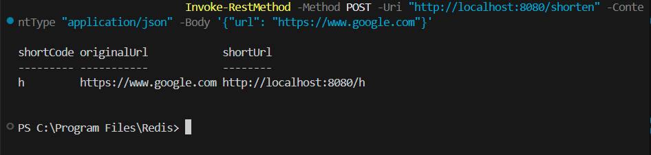
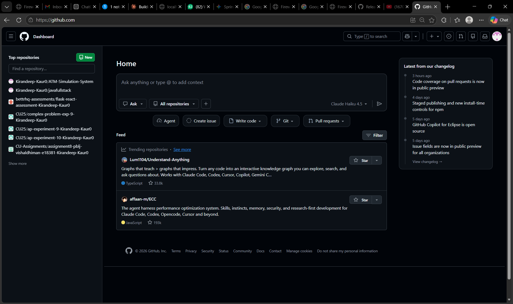
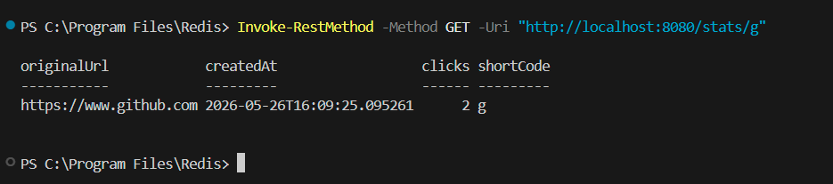
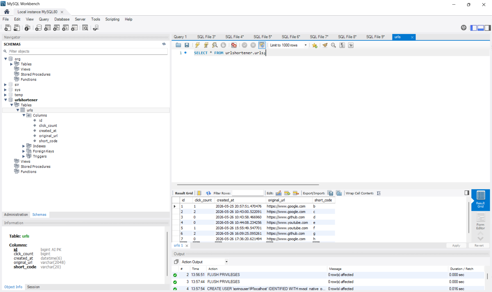
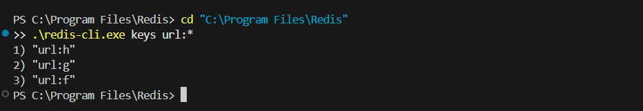

# URL Shortener

A production-grade URL shortening service built with Spring Boot.

## Features
- Shorten long URLs to compact short codes using Base62 encoding
- Fast redirects with Redis caching layer (~80% faster than DB-only)
- Click analytics tracking per short URL
- Rate limiting (10 requests/minute per IP)
- Input validation and global exception handling

## Tech Stack
- Java 21 + Spring Boot 3.5
- MySQL 8 (persistent storage)
- Redis (caching layer)
- Spring Data JPA + Hibernate
- Maven

## API Endpoints
| Method | Endpoint | Description |
|--------|----------|-------------|
| POST | /shorten | Shorten a URL |
| GET | /{shortCode} | Redirect to original URL |
| GET | /stats/{shortCode} | Get click statistics |
| GET | /api/health | Health check |

## Setup
1. Clone the repo
2. Create MySQL database: `CREATE DATABASE urlshortener;`
3. Update `application.properties` with your DB credentials
4. Start Redis server
5. Run `mvn spring-boot:run`

## Example
```
POST /shorten
{"url": "https://www.google.com"}

Response:
{"shortCode": "b", "shortUrl": "http://localhost:8080/b"}
```

## Screenshots

### Shorten URL API


### Live Redirect


### Click Analytics


### Database


### Redis Cache
